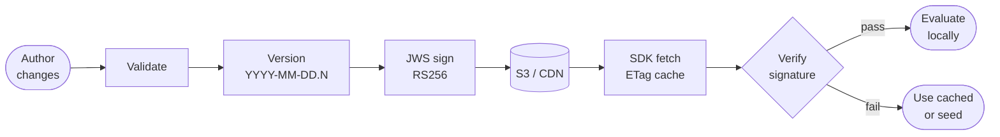

# Concepts

This document explains how Bunting works and why it is designed the way it is. If you want to do something specific, see the how-to guides. If you want exact format details, see the [Config Artifact Specification](config-artifact-spec.md).

---

## The core idea

Bunting distributes feature flags as a signed, static JSON file. The admin authors changes, publishes a new version, and the SDK running in each app fetches and evaluates the artifact locally. There is no server involved at evaluation time — everything happens on the device.

This gives you:

- Offline operation with no runtime dependency on Bunting infrastructure.
- Tamper detection via JWS signature verification before any config is applied.
- Fast flag reads (cached in memory, no network round-trip during evaluation).

---

## Flags, tests, and rollouts

These three concepts map to the three top-level collections in the config artifact.

### Flags

A **flag** is a typed key with a default value and an optional list of variant rules. Types are: `bool`, `string`, `int`, `double`, `date`, and `json`.

Every flag defines separate defaults for `development`, `beta`, and `production`. This is the environment-first model: a flag never has a single global default; it always has three.

Flag keys use `lowercase_snake_case` with optional namespace prefixes: `store/use_new_paywall_design`.

### Tests (A/B experiments)

A **test** assigns users to named groups (`control`, `variant_a`, etc.) deterministically and reproducibly, using SHA-256 bucketing. The test defines traffic splits as percentages per group. A flag variant of type `test` maps group names to flag values.

### Rollouts

A **rollout** is a simpler form: a single percentage threshold. Users with a bucket number ≤ the percentage are "in" the rollout. A flag variant of type `rollout` sets a single value for all included users.

Both tests and rollouts use a `salt` field to ensure independent bucketing: two tests with the same user pool but different salts produce uncorrelated group assignments.

---

## The environment-first model

Every flag carries separate defaults for `development`, `beta`, and `production`. Variants are also per-environment. This means:

- A flag can be `true` in development by default (safe to develop against) and `false` in production (dark feature).
- A rollout can be active in beta at 100% while still at 0% in production.
- The SDK selects the environment at launch (`Bunting.configure(environment: .production)`) and the rest is automatic.

The admin publishes one artifact per app-environment pair. Each publish is independently versioned.

---

## The publishing pipeline

**Authoring:** Flag changes, A/B tests, and rollout adjustments are made in the admin UI and persisted to the database. Nothing is live until you publish.

**Validation:** Before generating the artifact, the admin runs a validation pass:

- Blocking errors: invalid JSON, missing environment defaults, invalid flag keys.
- Warnings (non-blocking): unreachable rules due to ordering, long descriptions.

**Versioning:** Each publish increments the `config_version` in `YYYY-MM-DD.N` format (e.g. `2025-09-23.3` is the third publish on that date). Historical versions are stored at `/versions/<config_version>.json`.

**Signing:** The admin signs the exact bytes of `config.json` using RS256 (JWS). The private key is stored securely in the admin environment (KMS or environment variable). The signature is written to `config.json.sig`.

**Delivery:** Both files are uploaded to S3-compatible storage and served via CDN. Recommended headers: `Cache-Control: max-age=300, stale-while-revalidate=86400` with `ETag` for conditional fetches.

**SDK fetch and verify:** On launch and on each foreground transition (respecting a configurable minimum interval), the SDK fetches `config.json` and its signature. It verifies the signature against the public keys embedded in `BuntingConfig.plist`. On failure it falls back to the last-known-good cached config, then to the bundled seed JSON.

**Local evaluation:** Once a verified config is loaded, all flag evaluation happens in memory on the device with no further network calls.

---

## Deterministic bucketing

Tests and rollouts assign users to buckets using a deterministic algorithm so that the same user always gets the same variant.

**Algorithm:**

1. Build the input string: `salt:localId` — a single colon separating the test/rollout salt from the user's device UUID.
2. Encode as UTF-8 and compute SHA-256.
3. Interpret the first 8 bytes of the digest as an unsigned big-endian 64-bit integer.
4. `bucket = (value % 100) + 1` — result is 1 to 100 inclusive.

The salt is generated randomly by the admin when a test or rollout is created and is **never changed** after first publish. Changing the salt remaps all users and breaks experiment continuity.

Using different salts across tests means a user who is in the "control" group for one experiment has an independent, uncorrelated assignment for another.

The admin's `src/lib/bucketing.ts` reads the first 8 bytes (16 hex characters) of the hash as a big-endian unsigned 64-bit integer, matching the SDK (`Bucketing.swift`) and the artifact spec — so admin previews assign the same user to the same bucket the SDK does for a given `(salt, localId)`.

---

## Security model

**Signature verification** is the core trust mechanism. The SDK will not apply any config it cannot verify. The public keys shipped in `BuntingConfig.plist` are long-lived; multiple keys are supported for rotation. Old builds keep working as long as their embedded keys remain valid.

**Key rotation** works without forcing app updates: the admin can sign with a new private key while the old one is still trusted by deployed apps. New app versions add the new public key; old builds continue to verify with the old one.

**Fallback chain:** verified fetched config → last-known-good cache → bundled seed JSON. The seed is the snapshot of flags at the time the app was built, ensuring the app behaves sensibly with no connectivity at all.

**Authentication:** The admin is protected by NextAuth-based authentication supporting OIDC, OAuth (Google, GitHub, Microsoft), and email magic links. The first user to sign in becomes the admin. Role-based access control restricts who can publish.

---

## Multi-app support

One Bunting Admin installation can manage multiple apps. Each app has:

- Its own `app_identifier` (user-defined, independent of bundle ID).
- Its own set of flags, tests, and rollouts.
- Its own signing keys and CDN artifact URL.
- Its own publish history (audit log).

---

## Flag lifecycle

A flag's removal path depends on whether it has ever been published:

- **Never published** → delete directly. The flag has never appeared in a release,
  so no client has seen it; deleting removes it as if it never existed. Such a flag
  **cannot** be archived.
- **Published** → must be archived, released at least once while archived, then
  deleted: `Active → Archived → (publish) → Deleted`.

**Active:** Normal operation. Editable; included in the published artifact.

**Archived:** Edits are locked (unarchive to edit again). The flag **stays in the
artifact** with `deprecated: true` so existing clients keep resolving it. The Swift
SDK codegen emits `@available(*, deprecated, message: "Flag archived")` for the
generated accessor, and at runtime the SDK fires
`didReadDeprecatedFlag(flagKey:)` the first time a deprecated flag is read. Archiving
is only allowed for a flag that has been published; a never-published flag is deleted
instead.

**Deleted:** Removed from the artifact. Only allowed once the flag has been released
at least once in its archived (deprecated) state — so clients received the
deprecation signal before the flag disappears. After deletion, apps that still read
the key fall back to last-known-good cache → bundled seed → code default.

---

## Glossary

| Term                | Definition                                                                                                                                       |
| ------------------- | ------------------------------------------------------------------------------------------------------------------------------------------------ |
| **flag**            | A typed feature toggle. Identified by a `flag_key`. Has per-environment defaults and optional variant rules.                                     |
| **variant**         | A rule that may override a flag's default for a matching user. Has a `type` (`conditional`, `test`, or `rollout`), an `order`, and a `value`.    |
| **condition**       | A single predicate evaluated against user/device attributes (e.g. `platform in [iOS]`, `os_version >= 18.0`).                                    |
| **test**            | A named A/B experiment. Uses deterministic bucketing to assign users to named groups with configured traffic splits.                             |
| **rollout**         | A percentage-based gradual release. Users with `bucket <= percentage` receive the rollout value.                                                 |
| **salt**            | A random string assigned at creation to a test or rollout. Combined with the user's UUID to produce their bucket. Immutable after first publish. |
| **bucket**          | An integer 1–100 assigned to a user for a given test or rollout via the SHA-256 bucketing algorithm.                                             |
| **environment**     | One of `development`, `beta`, or `production`. Flags carry separate defaults and variants per environment.                                       |
| **config artifact** | The signed JSON file (`config.json`) generated by the admin and consumed by the SDK.                                                             |
| **config_version**  | Publish identifier in `YYYY-MM-DD.N` format. Increments monotonically.                                                                           |
| **seed**            | A snapshot of the config artifact bundled inside the app at build time. Used as last-resort fallback.                                            |
| **kid**             | Key ID included in the JWS header to identify which public key to use for verification. Enables key rotation.                                    |
| **app_identifier**  | User-defined string that identifies an app within Bunting Admin. Independent of the bundle ID.                                                   |

---

## Screenshots

screenshot: TODO — see [docs/images/README.md](images/README.md) for capture instructions.
